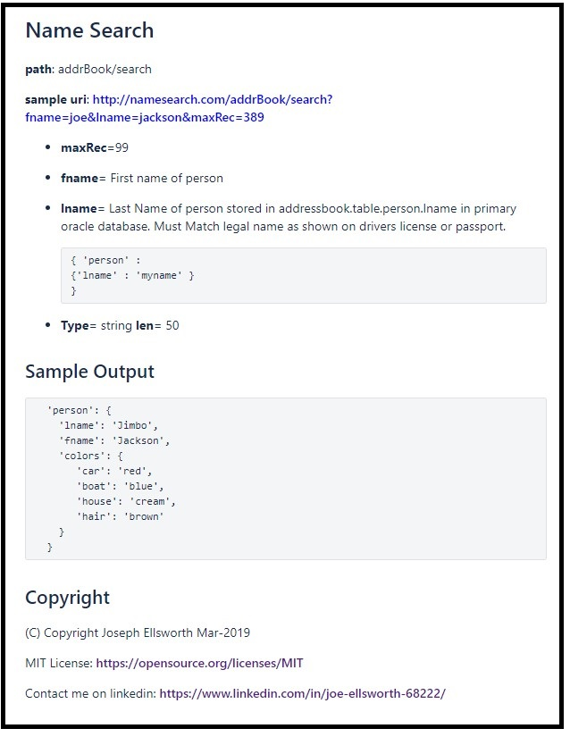

# Interpolator

*Reads* a text or markdown file and replaces defined values with contents from previously defined content such as a dictionary or object definitions.    

*  Aids in the production of consistent documentation when many fragments of content are reused in different context across many files by interpolating descriptive text or other field data directly from shared definitions.  
   *  Minimizes re-editing many files due to cut and paste.
   *  Encourages creating a dictionary that is managed using source code workflow.
   *  Encourages defining structures used by a multiple md API once and re-using them.    
   *  Interpolating selected fields from yml files that represent the dictionary reduces the need to edit copy / paste when descriptions have they are re-used across many markdown files.  
   *  Provides a easily extensible format to add more data elements to the dictionary
   *  Provides a change log, audit history and approvals using standard git workflow.
*  Allows easy custom production versions useful  when the final published documentation may include internal technical descriptions or may need to be adjusted for public consumption by only including descriptions approved for external publishing.   
*  Produces both expanded markdown and html files to allow easy viewing.
*  Supports html page auto reload and auto regeneration to easily show the results as markdown is edited.

## Command Line API

### Sample Invocation

```
interpolate  -in=data/sample -out=out -glob=*.md -search=./data/data-dict  -VarNames=desc,tech_desc  -keepNames=yes -maxRec=99 -loopDelay=5 -saveHtml=yes
```

```
  -in = path to input directory containing files to process. 
        Defaults to ./data
  -out = path to output directory where expanded files will be
         written.   defaults to ./out
  -glob= glob pattern to use when selecting files to process in 
         input directory.  Defaults to *.md
  -search = Directory Base to search for files named in
         interpolated parameters.
  -varNames = Default variable name  matched in dictionary files.
         Can be overridden if variable name is specified using 
         #varname semantic.    May be common separated list to 
         allow default lookup of backup fields such as look first 
         in tech_desc then in desc. -varNames=desc,tech_desc - 
         Causes the system to search first in the desc: field 
         then in the tech_desc.   This would use the business 
         description to be used first and then filled in tech 
         desc if desc is not found.   Just reverse the order to 
         cause it to use the technical description first. It 
         will use the first one found.   When the varname is 
         specified using the # semantic it will use the 
         specified var name and ignore the default varNames.
  -keepNames = when set to true it will keep the supplied path as 
         part of output text.   When not set or false will 
         replace content of path with content.
  -saveHtml=yes when set to yes will convert the md file to Html
         and save it in the output directory.   When not set the
         the system will not save the HTML file. 
  -maxRec this is a variable defined on command line that is 
         being interpolated.  Resolution of variables defined 
         on command line take precedence over those  resolved 
         in files. 
  -loopDelay - When set the system will process the input.  
         Sleep for a number of seconds and then re-process.
         This is intended to keep a generated file available to 
         easily reload.  eg:  -loopDelay=30 will cause the system to 
         reprocess the input files once every 30 seconds. 
         When not set the system will run once and quit.
  -recurseDir=yes - When set to yes the system will recursively walk
         all directories contained in the -in directory and process
		 every file that matches the glob patttern.  If not set will
		 only walk the named directory.  When recurseDir is set to 
		 yes then it will create directories in the output directory
		 that mirror the input directory path whenever a matching input
		 file is found.          
```

* The command above assumes that you have built the interpolate executable as described in the build section below.   It also assumes that you have added the interpolate executable to the search path.

### Save  version with markdown converted to HTML

```
interpolate  -in=data/sample -out=out -glob=*.md -search=./data/data-dict  -VarNames=desc,tech_desc  -keepNames=true -maxRec=99 -saveHtml=yes
```

* Adding the -saveHtml=yes will cause the system to re-read the expanded markup and write a HTML version. 
* When -loopDelay is set with -saveHtml javascript is added to the HTML page to cause it to refresh on roughly the same loop cycle.  

### Run in a Continuous Loop to support easy preview

```
interpolate  -in=data/sample -out=out -glob=*.md -search=./data/data-dict  -VarNames=desc,tech_desc  -keepNames=true -maxRec=99 -saveHtml=yes -loopDelay=10
```

* Adding -loopDelay=10 will cause the system to process the files and then wait for 10 seconds before reprocessing the file.  This will cause the system to repeatedly regenerate the expanded markdown files.  If -saveHtml=yes is also set then it will also cause the system to regenerate generated html.

# Data Format API

The sample shown here uses md (markdown) syntax but it would work with any text file that can be parsed in a similar fashion. 

## Sample Input

[sample-api.md](data/sample-api.md)

```markdown
# Name Search

**path**: addrBook/search

**sample uri**: http://namesearch.com/addrBook/search?fname=joe&lname=jackson&maxRec=389

* **maxRec**={*maxRec}
* **fname**= {*person/fname}
* **lname**= {*person/lname#tech_desc}
* **Type**={*person/lname#type}  **len**={*person/lname#len}

## Sample Output
{*inc: share/person/example_person.md}

## Copyright
{*inc: share/legal/copyright.txt}
```

* Any string contained inside of {} will be treated as a variable that needs to be resolved.  When first character after { is *.    The * was used to make it easier to avoid parsing and attempted interpolation when sample JSON or other curly brace languages are part of input. 

  * The system will first attempt to match the defined variable name in parameters passed in on the command line.     
  * It will search for a file at the path starting at base dir and will attempt to load that file. 
  * Any pathname that includes a # segment will treat everything before the # as the file path and anything after it as a matching path to find a segment within the file.
  * When -defaultVarName is set the system will use it to search inside the file content for a specified field.     
  * Any lookup key value in {} that starts with https:// or http:// will be treated as a URI and the system will return any text returned from that URI in the output document. 

* The system will always match the closest } whenever it encounters the opening {.  The closing } must not be separated by vertical white space such as /n.

* Any variable name not matched with a valid defined string or file will be replaced be included untouched.

* Any interpolated variable starting with "inc:" will be treated as a simple file include where the entire file located at the specified path will be read and inserted into the output replacing the {path}. 

* Dictionary YML must follow a simplified format.  The match pattern is simply the variable name that must start on first of line followed by :.   It will include text until it detects the next word followed by a : followed by a space.

  


## Sample Data Dictionary LOOKUP

**[person/fname.yml](data/data-dict/person/fname.yml)**

```
name: fname
domain: addressbook
table: person
desc: First name of person
type: string
len: 50
```

**[person/lname.yml](data/data-dict/person/lname.yml)**

```
name: lname
domain: addressbook
table: person
desc: Last Name of person
tech_desc: Last Name of person stored in addressbook.table.person.lname in primary oracle database. 
  Must Match legal name as shown on drivers license or passport.
```
  { 'person' : 
    {'lname' : 'myname' } 
  }
  ```
type: string
len: 50
  ```

* Notes the multi-line value for tech_desc The system will allow this even though it is not formally syntactically correct yml.

**[legal/copyright.txt](data/data-dict/share/legal/copyright.txt)**

```txt
(C) Copyright Joseph Ellsworth Mar-2019
MIT License: https://opensource.org/licenses/MIT
Contact me on linkedin: https://www.linkedin.com/in/joe-ellsworth-68222/
```

**[shared/person/example_person.md](data/data-dict/shared/person/example_person.md)**

Used to show the concept of a re-usable shared component.

```
​```
  'person': {
    'lname': 'Jimbo',
    'fname': 'Jackson',
    'colors': {
       'car': 'red',
       'boat': 'blue',
       'house': 'cream',
       'hair': 'brown'
    }
  } 
​```
```


## Sample Output



# Build

Once you have the  [golang compiler](https://golang.org/dl/) installed.    

```
go get -u -t "github.com/joeatbayes/interpolator/interpolate"
```

It will create a executable in your GOPATH directory in bin/interpolate.  For windows it will be httpTest.exe.  If GOPATH is set the /tmp then the executable will be written to /tmp/bin/interpolate under Linux or /tmp/bin/interpolate.exe for windows. 

> Once you build the executable you can copy it to other computers without the compiler.   It only requires the single executable file.

HINT: set GOTPATH= your current working directory.  Or set it to your desired target directory and the go get command will create the executable in bin inside of that directory which is good because you may not have write privileges to the default GOPATH.

##### To Download all pre-built test cases, scripts and source code

```
git clone https://github.com/joeatbayes/interpolator interpolate
```

### To Build for Multiple OS Linux / Windows / Mac 

[make-go-all-os.bat](make-go-all-os.bat): Batch file to build executable for multiple OS.  runs on windows 

#### Windows example to build for other OS 

```bash
set GOPATH=%cd%

go get -u "github.com/joeatbayes/goutil/jutil"

set GOOS=darwin
set GOARCH=386
go build -o interpolate-darwin-386 interpolate/interpolate.go 

set GOOS=linux
set GOARCH=386
go build -o interpolate-linux-386 interpolate/interpolate.go 

set GOOS=windows
set GOARCH=386
go build -o interpolate-windows-386 interpolate/interpolate.go 

set GOOS=solaris
set GOARCH=amd64
go build -o interpolate-solaris-amd64 interpolate/interpolate.go 

```

* Note: The make-go-all-os.bat saves executables with custom names so they can co-exist in the same directory.   You will need to rename the proper one for the interpolate executable for the commands above to work.    

