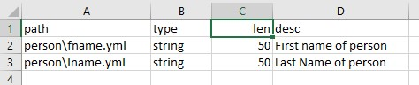

# yml2csv

> **Extract Named Fields from set of YML files and convert to a TSV (Tab Delimited) file**


## Example Command

```bash
yml2csv  -in=../data/data-dict/db -out=tmp.tsv glob=*.yml  -vars=type,len,desc
```

```
-in  =  Directory to read. Files will be read recursively.

-out =  output file to write TSV file to.

-glob=  glob path filter used to filter set up input files
        processed.
        
-vars=  list of variable names to be included in output
        the relative path to input file is always first
        column.
```


## Example Output

```
path    type    len     desc
person\fname.yml        string  50      First name of person
person\lname.yml        string  50      Last Name of person
```

## Example Output in Excel



## Build

```
go get -u -t "github.com/joeatbayes/interpolator/yml2tsv"
```

## Contributing

- Please send permission to include your logo as one of the users.  Or give us your use case so we can share it with other.   You can [file an issue](https://github.com/joeatbayes/interpolator/issues),  contact [me on linked-in](https://www.linkedin.com/in/joe-ellsworth-68222/) or fork the repository, add the files and submit a pull request.
- Please  [file an issue](https://github.com/joeatbayes/interpolator/issues) for Enhancements.  I have been known to buy lunch for people who submit particularly good enhancement requests or who find interesting flaws.
- Feel free to Fork and submit pull requests.
- See: [actions](actions.md) for a list of features planned under consideration & completed.